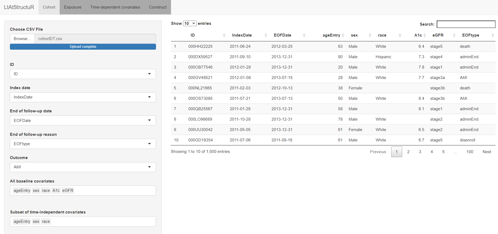
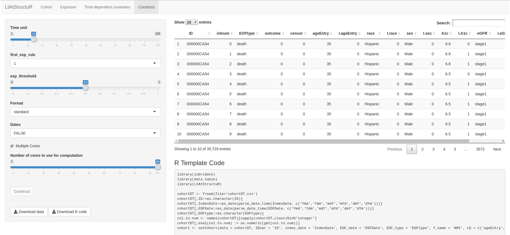

---
output:
  rmarkdown::github_document
# bibliography: "README-refs.bib"
---

<!-- README.md is generated from README.Rmd. Please edit that file -->

```{r, echo = FALSE}
knitr::opts_chunk$set(
  collapse = TRUE,
  comment = "#>",
  fig.path = "README-"
)
```

# R/`LtAtStructuR`

> Structuring of Complex Longitudinal Data into Long Format

__Authors:__ [Romain
Neugebauer](https://divisionofresearch.kaiserpermanente.org/researchers/neugebauer-romain), Noel Pimentel, and Nima Hejazi

---

## What's `LtAtStructuR`?

The goal of `LtAtStructuR` is to structure a collection of time-stamped
measurements (e.g., electronic health record data)  into a standard long format
analytic dataset suitable for the evaluation of the effect of multiple
time-point interventions in the presence of time-dependent confounding or
sources of selection bias.

---

## Installation

Download the `LtAtStructuR` directory and install the package from the command
line using

```{bash cmdline-source-install, eval=FALSE}
R CMD INSTALL LtAtStructuR
```

or from within R using the package tarball (`.tar.gz`) with

```{r r-source-install, eval=FALSE}
install.packages("PATH/TO/LtAtStructuR_version.tar.gz", type = "local")
```
where the path to the package tarball and version number must be amended. A
tarball may be generated by invoking `Rscript -e "devtools::build()"` from the root directory of this project.

---

## Documentation

[How to use the package? (Description of input/output)](./vignettes/vignette0.html)

[What data coarsening algorithms are implemented by the package?](./vignettes/vignette1.html)

---

## Example

This is a basic example which shows how to structure longitudinal data with an interval exposure:

```{r example, eval=FALSE}
library(LtAtStructuR)
library(data.table)
library(lubridate)
library(future) # optional (for parallel processing)
plan(multiprocess) # optional (for parallel processing)

## Define one cohort dataset, one exposure dataset, and one or more covariate
## datasets
cohort <- setCohort(cohortDT, "ID", "IndexDate", "EOFDate", "EOFtype",
                    "AMI", c("ageEntry", "sex", "race", "A1c", "eGFR"),
                    list("ageEntry"=list("categorical"=FALSE,
                                        "impute"=NA,
                                        "impute_default_level"=NA),
                        "sex"=list("categorical"=TRUE,
                                   "impute"=NA,
                                   "impute_default_level"=NA),
                        "race"=list("categorical"=TRUE,
                                    "impute"=NA,
                                    "impute_default_level"=NA)) )
exposure <- setExposure(expDT, "ID", "startA", "endA")
covariate1 <- setCovariate(a1cDT, "sporadic", "ID", "A1cDate", "A1c",
                           categorical = FALSE)
covariate2 <- setCovariate(egfrDT, "sporadic", "ID", "eGFRDate", "eGFR",
                           categorical = TRUE)

## Gather each input dataset into a single object that specifies the content of
## the output dataset to be constructed
LtAt.specification <- cohort + exposure + covariate1 + covariate2

## Construct the output dataset
LtAt.data <- construct(LtAt.specification, time_unit = 15, first_exp_rule = 1,
                       exp_threshold = 0.75)
```

---

## Shiny App

`LtAtStructuR` can also also be used through an interactive Shiny web application that automates the process of defining the cohort, exposure, and covariate datasets. The shiny application currently only supports interval exposures. 

The shiny application can be executed by running the command:

```{r shiny example, eval=FALSE}
runShiny()
```



The tabs `Cohort`, `Exposure`, `Covariates`, and `Construct` are analogous to the `setCohort`, `setExposure`, `setCovariate`, and `construct` functions, respectively; each tab offers an interactive user-interace to select input criteria pertaining to each of these functions. As a final step of the application, the user can download the output dataset and R template code specific to the construction of that dataset:



---

## License

&copy; 2019 [Romain S. Neugebauer](https://divisionofresearch.kaiserpermanente.org/researchers/neugebauer-romain)

The contents of this repository are distributed under the GPL-3 license. See
file `LICENSE` for details.

